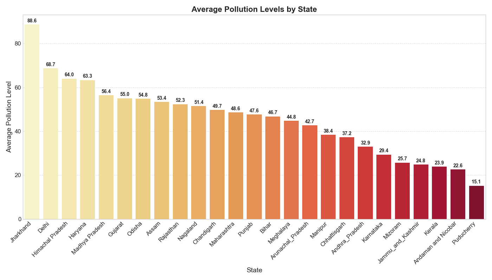
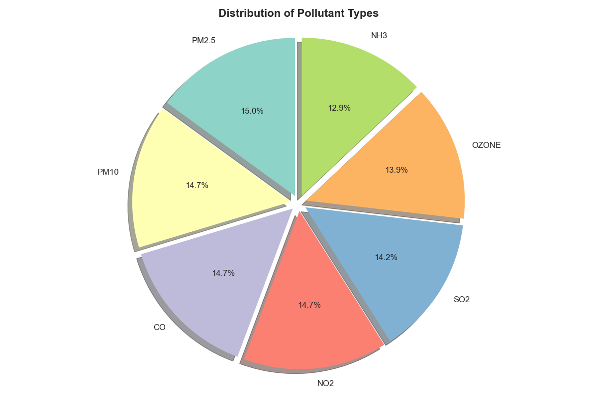
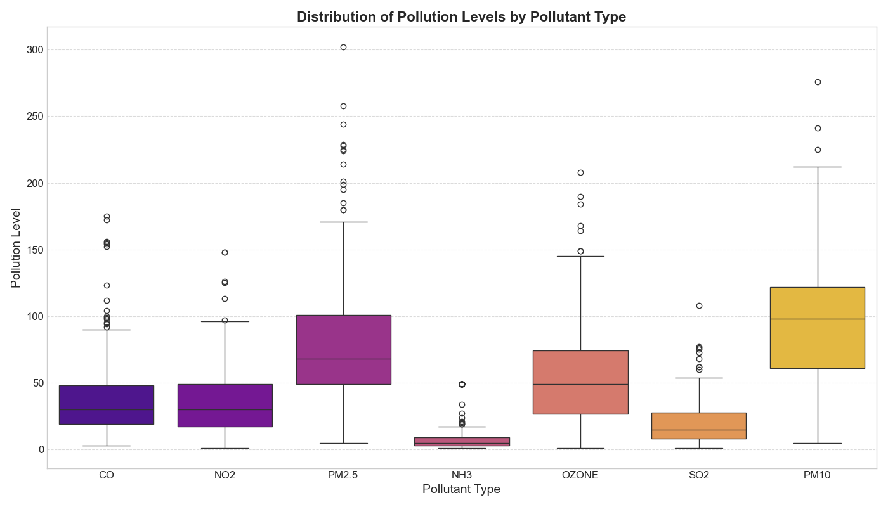
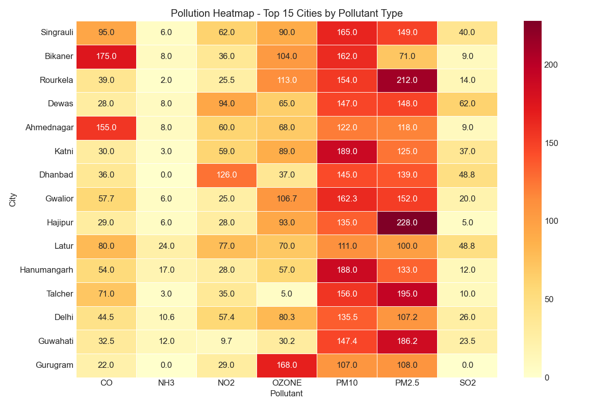
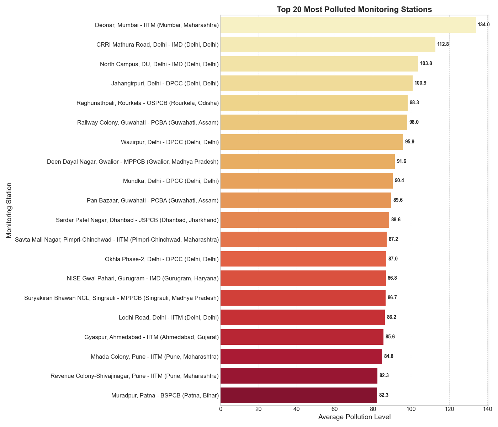
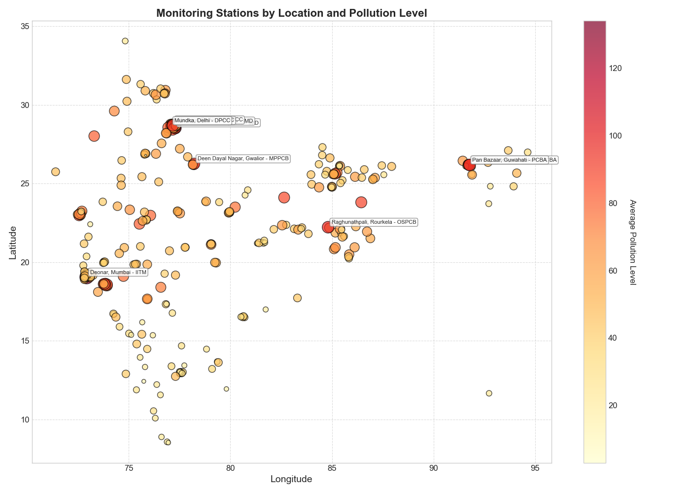

🏭 Air Quality Data Analysis in India
This project analyzes realtime India's air quality dataset using Python, with a focus on pollution levels across states, cities, and monitoring stations. It provides insights through rich visualizations and statistical testing.
The dataset is dated to 5th of April 2025.

📂 Dataset
File Name: air_quality_india.csv

Source: data.gov.in Website

The dataset includes information on:

City, state, station names

Pollutant type and values

Latitude and longitude

Time-stamped air quality data

🧰 Libraries Used
Pandas: Data manipulation

NumPy: Numerical operations

Matplotlib: Static visualizations

Seaborn: Advanced plotting

SciPy: Statistical testing

📊 Features & Analysis
✅ Basic EDA:
Data structure and types

Null value checks

Descriptive statistics

Top & least polluted cities

🧼 Data Cleaning:
Missing value imputation

Pollutant type detection

Pollution average computation

📈 Visualizations:
## 📊 Visualizations

### 1. State-wise Average Pollution

### 2. Pollutant Type Distribution

### 3. Maximum Pollution by Pollutant Type

### 4. City Pollution Heatmap

### 5. Top Polluted Monitoring Stations

### 6. Monitoring Stations Scatter Map

📐 Statistical Analysis:
T-Test between two states (Delhi vs Bihar)

Z-Test comparing a city (Patna) against the national average

📌 How to Use
Clone this repo or download the script.

Make sure the dataset air_quality_india.csv is in the same directory.

Run the script with Python 3:

bash
Copy
Edit
python air_quality_analysis.py
📎 All graphs and analysis will be displayed sequentially in the output.

📚 References
data.gov.in – Government air quality data

numpy.org – Numerical computing library

pandas.pydata.org – Data analysis and manipulation tool

matplotlib.org – Visualization library

seaborn.pydata.org – Statistical data visualization

✍️ Author:-
Abhishek Kumar Mishra
Shivam Kumar
